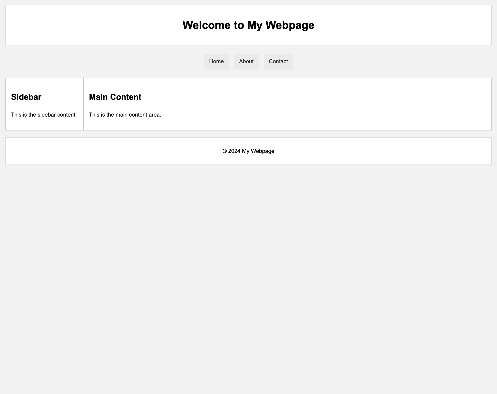
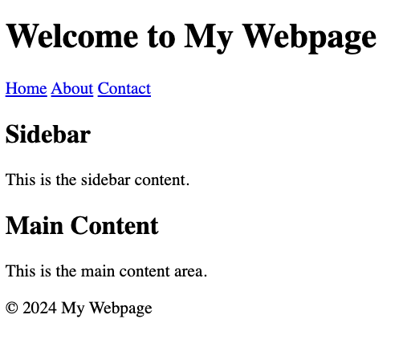

# Box Model and Display Properties


##

## Description

In this assignment, we will explore the CSS box model together, which defines how the different parts of a box—content, padding, border, and margin—interact with each other and with surrounding elements. You’ll learn how to manipulate these properties to create diverse layouts and how various display properties (block, inline, inline-block) affect the flow and positioning of elements on a webpage. By the end of this exercise, you should feel confident working with the CSS box model and understand how display properties influence the overall structure of a webpage.


## Expected Project Structure

```plaintext
BoxModel/
├── index.html
└── styles.css
```

## Instructions

Let's create that project structure

## 1. **Create the Project Folder and Files**
   - [ ] Create a folder named `TheBoxModel` to store all your project files.
   
   - [ ] Inside the `TheBoxModel` folder, create a file named `index.html`. This will be your main HTML file.
   
   - [ ] Also, in the `BasicCSS` folder, create another file named `styles.css`. This file will contain the CSS used to style your HTML content.

## 2. **HTML Boilerplate**
Now that you have your files set up, start by adding the basic HTML5 boilerplate to set up the foundation of your document in `index.html`.

```html
<!DOCTYPE html>
<html lang="en">
<head>
  <meta charset="UTF-8">
  <meta name="viewport" content="width=device-width, initial-scale=1.0">
  <title>Display Types Showcase</title>
  <link rel="stylesheet" href="styles.css">
</head>
<body>
<!-- Display code goes here -->
</body>
</html>
```

**Explanation:**
- Declares the document as HTML5 and sets up the essential metadata and styles.

## 3. **Adding Content to the Body**

Next, add the main content inside the `<body>  </body>` tags:

```html
<body>
  <h1 class="page-title">CSS Display Types Showcase</h1>
  <div class="container">
    <div class="card block-card">
      <p>I am a <strong>block</strong> element. I take up less width but still start on a new line.</p>
    </div>

    <div class="inline-container">
      <span class="card inline-card">I am an <strong>inline</strong> element.</span>
      <span class="card inline-card">Another <strong>inline</strong> element.</span>
    </div>

    <div class="inline-block-container">
      <div class="card inline-block-card">I am an <strong>inline-block</strong> element. I respect width and height properties.</div>
      <div class="card inline-block-card">Another <strong>inline-block</strong> element beside me.</div>
    </div>
  </div>
</body>
```

**Explanation:**
- Demonstrates the usage of block, inline, and inline-block display types.

## 4. **Adding the Footer**

Finally, include a footer to summarize the differences between display types:

```html
<footer class="footer">
  <p class="footer-title">Summary of Differences:</p>
  <p><strong>Block:</strong> Full width, forces a line break. Examples: div, p.</p>
  <p><strong>Inline:</strong> Only takes needed space, stays inline. Examples: span, a.</p>
  <p><strong>Inline-Block:</strong> Inline, but allows width/height. Examples: img, button.</p>
</footer>
```

**Explanation:**
- Provides a summary of the key differences between block, inline, and inline-block elements.

##

## Let's take a look at the progress of our webpage unstyled.
Open your `index.html` file in the browser and review your current work with no styles applied.
##


##

### Now add CSS code to style your page
Open the `styles.css` file in the `TheBoxModel` folder and add the following code to style your webpage:

## 5. **CSS Reset**

Let's apply some CSS code to our body by removing default browser-specific styles, providing a consistent baseline for design

```css
body {
    font-family: 'Segoe UI', Tahoma, Geneva, Verdana, sans-serif;
    background-color: #e0f7fa;
    margin: 0;
    padding: 0;
    display: flex;
    flex-direction: column;
    align-items: center;
    min-height: 100vh;
}
```
**Explanation:**
- Resets default margins and padding for consistency.
- Sets the default font and background color.
- Utilizes `display: flex` to align content centrally with a column direction.

## 6. **Page Title Styling**

Let's style the title to our web page.

```css
.page-title {
    color: #00796b;
    margin: 20px 0;
    font-size: 1.4em;
    text-align: center;
}
```
**Explanation:**
- Styles the main page title with specific color, margin, and font size.
- Centers the text using `text-align: center`.

## 7. **Container Styling**

Next we apply CSS to format the container of our page.

```css
.container {
    width: 80%;
    max-width: 1100px;
    padding: 40px;
    background-color: #ffffff;
    border-radius: 8px;
    box-shadow: 0 0 15px rgba(0, 0, 0, 0.1);
    text-align: center;
    margin-bottom: 20px;
}
```
**Explanation:**
- Defines the container's dimensions and adds padding.
- Sets a white background and adds a subtle shadow for a lifted effect.
- Rounds the corners using `border-radius`.

## 8. **Card Base Styling**

We will apply padding and margins to our card, as well as add borders, to make it more visually appealing.

```css
.card {
    padding: 8px;
    margin: 6px 0;
    border-radius: 5px;
    border: 2px solid;
    font-size: 0.8em;
}
```
**Explanation:**
- Adds padding and margin to space the content.
- Applies a border and rounds the corners of the card.
- Sets the font size for text within the card.

## 9. **Block Card Styling**

Apply styling to the `bloc-card` elements on our page.

```css
.block-card {
    display: block;
    width: 98%;
    background-color: #b2dfdb;
    border-color: #00796b;
    margin: 0 auto;
}
```
**Explanation:**
- `display: block` makes the element take up the full width of its container.
- The card has a specific background color and border.
- Centers the block element within its container using `margin: 0 auto`.

## 10. **Inline Container**

Apply a top margin  to the `inline-container` elements on our page.

```css
.inline-container {
    margin-top: 20px;
}
```
**Explanation:**
- Adds top margin to space the inline container from previous content.

## 11. **Inline Card Styling**

Apply specific styles to our inline-card class elements.

```css
.inline-card {
    display: inline;
    width: auto;
    margin: 2px;
    padding: 5px 10px;
    background-color: #ffccbc;
    border-color: #ff7043;
    color: #d84315;
}
```
**Explanation:**
- `display: inline` makes the element take up only as much width as its content.
- The card has specific margins, padding, and colors, but does not break onto a new line.

## 12. **Inline-Block Container**

Add margin and alignment CSS to out `inline-block-container`

```css
.inline-block-container {
    margin-top: 20px;
    text-align: center;
}
```
**Explanation:**
- Adds top margin and centers content within the inline-block container.

## 13. **Inline-Block Card Styling**

Style the inline Block cards

```css
.inline-block-card {
    display: inline-block;
    width: 47%;
    padding: 10px;
    margin: 5px 1%;
    background-color: #fff9c4;
    border-color: #fdd835;
    color: #f57f17;
    box-sizing: border-box;
    font-size: 0.8em;
    vertical-align: top;
}
```
**Explanation:**
- `display: inline-block` allows setting width and height while still being inline.
- The card is styled with specific padding included in the element's width.
- Uses `vertical-align: top` to align the elements to the top.

## 14. **Footer Styling**

Now lets style our `footer`

```css
.footer {
    width: 60%;
    padding: 10px;
    background-color: #f0f4c3;
    text-align: left;
    font-size: 0.7em;
    margin-top: 10px;
    border: 2px solid #dfd802;
    border-radius: 10px;
}
```
**Explanation:**
- Sets the footer's width, padding, and background color.
- Aligns text to the left and applies a border with rounded corners.

## 15. **Footer Title Styling**

Footer title Styling

```css
.footer-title {
    color: #00796b;
    font-weight: bold;
    margin-bottom: 10px;
}
```
**Explanation:**
- Styles the footer title with color and bold font, and adds a bottom margin.

## 16. **Footer Paragraph Styling**

`p` tag styling within the `footer`

```css
.footer p {
    margin: 10px 0;
}
```
**Explanation:**
- Spaces out the paragraphs within the footer using top and bottom margins.


##

**Awesome work! You have successfully built a webpage layout using the CSS box model and display properties.** 

### Conclusion
In this assignment, you learned how to effectively use the CSS box model to control the spacing and layout of elements on a webpage. You also explored how different display properties, such as block and inline-block, influence the positioning of elements. By creating a basic webpage structure with a header, navigation, content area, sidebar, and footer, you gained practical experience in applying these concepts to build a responsive and well-organized webpage layout. Understanding these fundamental principles will be crucial as you continue to design and develop more complex web pages. Rember to use your AI assistant to ask questions and troubleshoot issues.

---
© All rights reserved to ThriveDX


